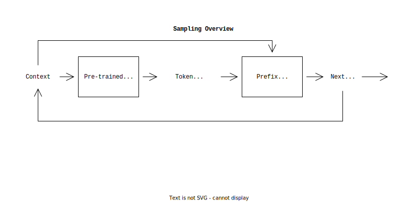

# Program Constrained Language Model Sampling

> The aim of this project is to investigate the use of program constraints on pre-trained language models to improve their ability to generate structured text as output.

Language models can accurately predict the next token in a sequence.
Unfortunately generated text is not necessarily structured in a way that can be utilised by other programs.
For example, a language model that extracts json objects from unstructured text may fail to produce a valid json object by adding additional trailing commas or introducing comments.

We propose a simple method to constrain the tokens that can be sampled by a language model by using an external program to decide which tokens in the vocabulary are valid at a given point in the sequence.
We then force the language model to *only* sample over these valid tokens.

# Overview

- **Language Model**: Any pre-trained language model that predicts the next token over some discrete probability distribution.
- **Prefix Checker**: A program that takes a sequence of tokens as input and can decide if the sequence is a valid output or output prefix.

## Related Work

- [Transformer Grammars](https://arxiv.org/abs/2203.00633)
- [Language Models as Zero-Shot Planners](https://arxiv.org/abs/2201.07207)
- [ProTo: Program-Guided Transformer for Program Guided Task](https://arxiv.org/abs/2110.00804)

- [Incremental Regular Expressions](http://jkff.info/articles/ire/)
- [Tree Sitter](https://tree-sitter.github.io/tree-sitter/creating-parsers)

## Supported Language Models

- [x] llama via llama.cpp
- [ ] rwkv via rwkv.cpp

## Supported Prefix Checkers

- [x] **[JSON](./README.md)**: Extracts JSON objects from unstructured text.
- [ ] **[JSON Schema](./README.md)**: Extracts JSON objects from unstructured text that match a given JSON schema.

## Evaluations and Results

TODO
